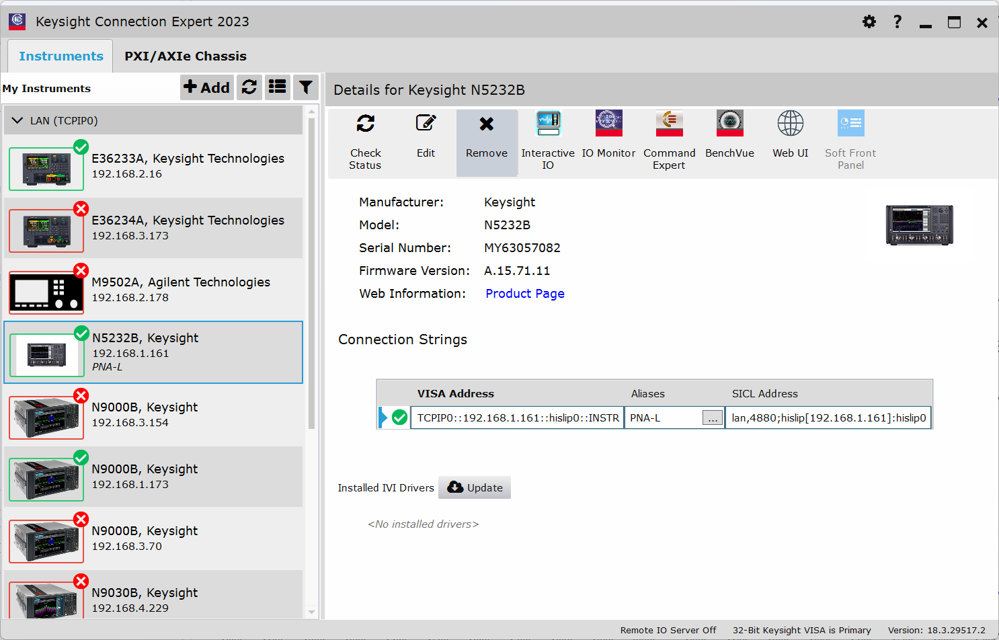
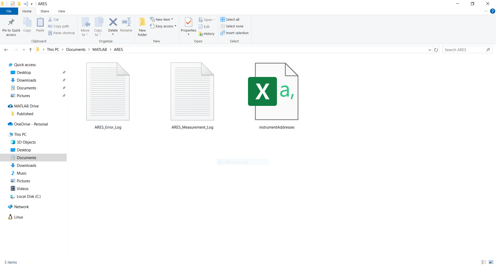
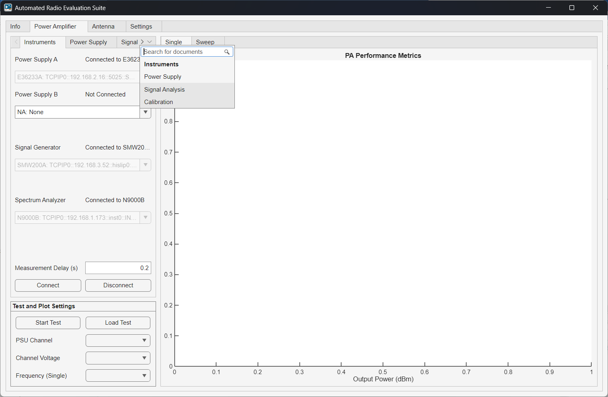

# FAQ 

---

## Do I need to install anything else to use ARES?

Most features in ARES work out of the box.

For TikZ export:

* The required **matlab2tikz** package is already bundled inside the ARES src folder.
* No external installation is required.

To ensure your environment is correctly configured, visit the [Getting Started](https://aresapp.readthedocs.io/latest/getting_started.html) page for setup steps and required MATLAB toolboxes.

## How do I find my instrument’s VISA address?

You can obtain the instrument's VISA address in several ways:
* On the instrument front panel (check LAN or IO settings).
* Use **Keysight Connection Expert** or similar software to scan your local network for supported devices.

{witdh=1920px align=center}

## My instrument is not connecting. What should I check?

If ARES is unable to connect to your instrument:

* Make sure the instrument and computer are on the same network.
* Verify that the IP addresses and subnet masks are compatible.
* Test the connection by pinging the device using the command line:

```none
ping XXX.XXX.XXX.XXX
```

* Ensure the VISA resource string is correctly formatted and entered in the instrument database.

## Can I edit the instrument list manually?

Yes, the instrument database is a `.csv` file located at:

```none
<userpath>/ARES/instrument_database.csv
```

You can open it in Excel, VS Code, or a text editor. Just make sure you preserve the format:

* Column headers: *Manufacturer*, *Model*, *Address*
* One row per instrument

## Where are my saved test results and logs stored?

All logs and configuration files are stored in your MATLAB user path under the `ARES` directory:

```none
<userpath>/ARES/
```

This includes:

* **ARES_Error_Log.txt** – logs internal app errors
* **ARES_Measurement_Log.txt** – logs the duration of each test
* **instrument_database.csv** – stores instrument addresses

Measurement results are saved wherever you choose when prompted after a test run. ARES opens a folder selection dialog, and you select the location.

{witdh=1920px align=center}

## How do I show hidden tabs in the app?

If you don’t see all available tabs, right-click and hold on the tab menu bar to expand hidden modules.

{witdh=1920px align=center}

## Why can’t I export a plot as PDF or TikZ?

Not all plot types support every export format:

* TikZ only works for Cartesian 2D plots.
* Polar plots cannot be exported using TikZ.
* PDF export is not supported for 3D radiation plots.

## VNA isn’t returning expected values, what should I do?

Unexpected or incorrect measurements are usually caused by instrument misconfiguration, cabling issues, or calibration mismatches. 

Here's a checklist to troubleshoot:

* Verify instrument calibration:
  * Use a calibration kit or eCal module to calibrate the VNA at the measurement plane (where the DUT and reference antenna connect).
  * Calibration should be done before connecting the VNA to ARES, using the same frequency range and number of sweep points you plan to use.
* Don’t change the VNA frequency sweep settings after calibration:
  * Once calibration is complete, do not adjust *Start/Stop Frequency* or *Sweep Points* in the app.
  * ARES reads the sweep settings from the VNA to preserve the calibrated state.
* Check cables and terminations.
* Inspect connectors for damage or wear.
