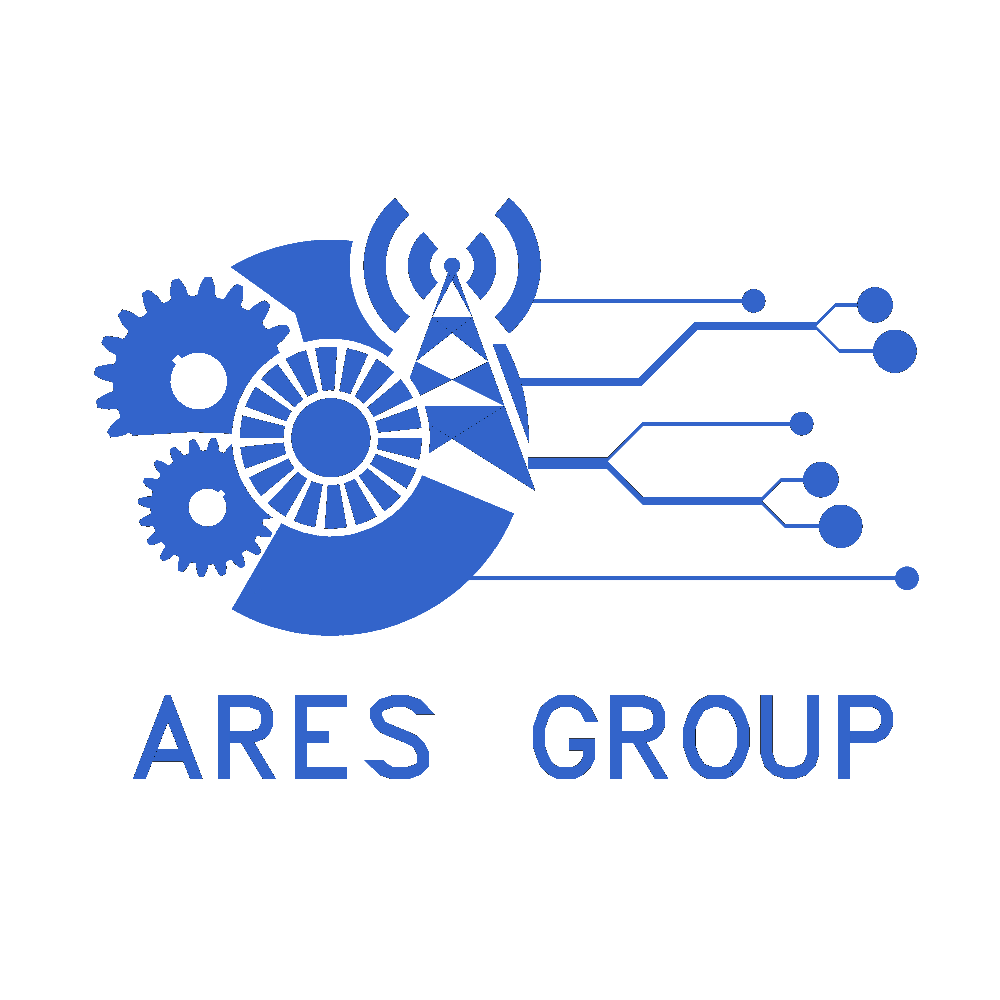

# Automated Radio Evaluation Suite Documentation

[](https://github.com/AlexDCode/AutomatedRadioEvaluationSuite/releases)
[](https://github.com/AlexDCode/AutomatedRadioEvaluationSuite/stargazers)
[](https://github.com/AlexDCode/AutomatedRadioEvaluationSuite/network/members)
[](https://github.com/AlexDCode/AutomatedRadioEvaluationSuite/issues)
[](https://github.com/AlexDCode/AutomatedRadioEvaluationSuite/pulls)
[](https://github.com/AlexDCode/AutomatedRadioEvaluationSuite/graphs/contributors)
[](https://github.com/AlexDCode/AutomatedRadioEvaluationSuite/blob/main/LICENSE.md)

The **Automated Radio Evaluation Suite (ARES)** enables automated RF measurements for power amplifiers and antennas. Unlike commercial software, this app is open-source, customizable, and free. Download the [latest release](https://github.com/AlexDCode/AutomatedRadioEvaluationSuite/releases) and follow the getting started guide to learn how to use it. Please note that the app is still in development, and some features may not be available in this release.

## Features

- VISA Instrument Control for multiple Keysight and ETS-Lindgren instruments by GPIB and LAN
- Measure RF power amplifier Figures of Merit (FoM) over one or multiple frequencies
  - Gain
  - Output Power
  - Drain Efficiency
  - Power Added Efficiency
- Measure antenna gain characteristics by:
  - Gain Comparison Method (i.e., Two-Antenna Method)
  - Gain Transfer Method (i.e., Comparison Antenna Method) using a reference gain file
- Measure antenna return loss (magnitude and phase)
- Save and recall measurements in standardized file formats for data analysis
- Plot measurement results within the app for quick visualization


<!-- File Tree -->
```{toctree}
:hidden:
:maxdepth: 2
:caption: Contents

getting_started.md
tutorial_ant.md
tutorial_PA.md
code_reference.md
gallery.md
FAQ.md
GitHub Repository <https://github.com/AlexDCode/AutomatedRadioEvaluationSuite>
```

## Contributors

{witdh=240px, align=center}

- Author: José Abraham Bolaños Vargas ([@bolanosv](http://github.com/bolanosv))
- Mentor: Alex David Santiago Vargas ([@AlexDCode](http://github.com/AlexDCode), [Google Scholar](https://scholar.google.com/citations?user=n_pFUoEAAAAJ&hl=en))
- PI: Dimitrios Peroulis ([Google Scholar](https://scholar.google.com/citations?user=agc3kMMAAAAJ&hl=en&oi=ao))
- Adaptive Radio Electronics and Sensors Group
- Purdue University
