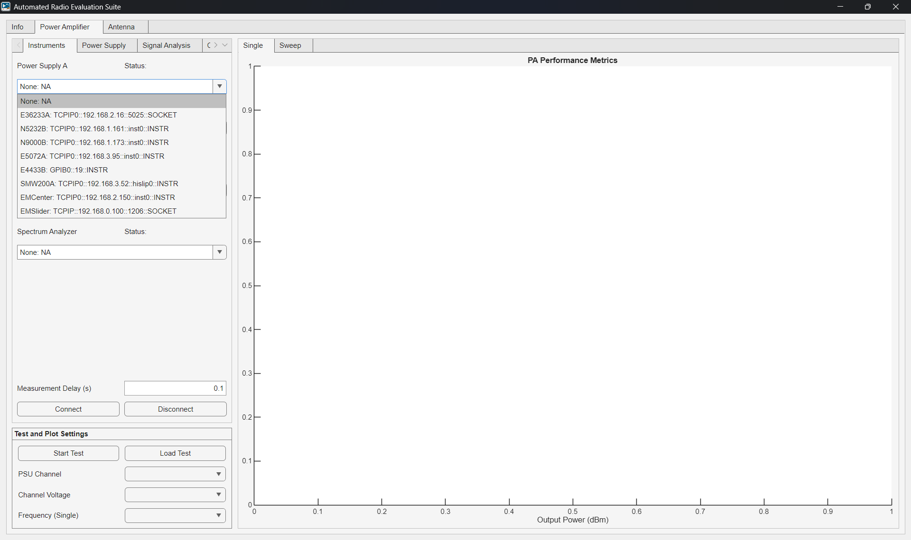
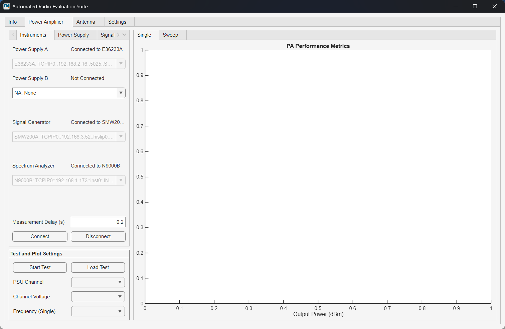
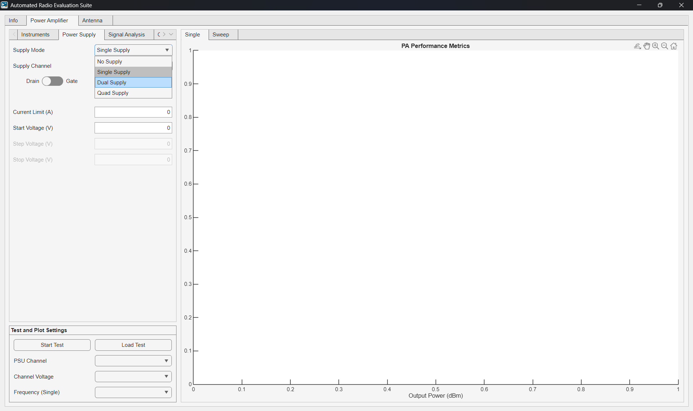
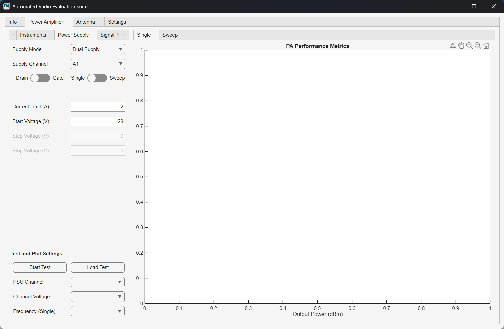
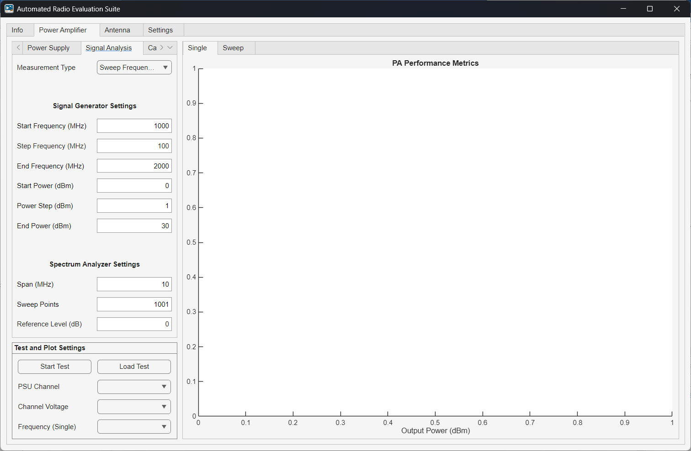
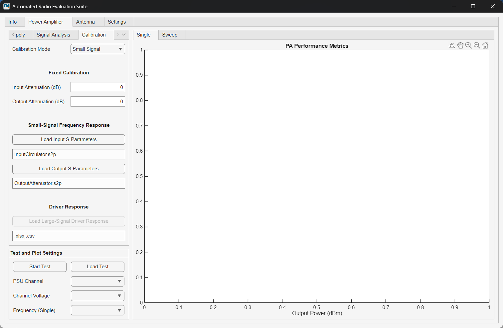
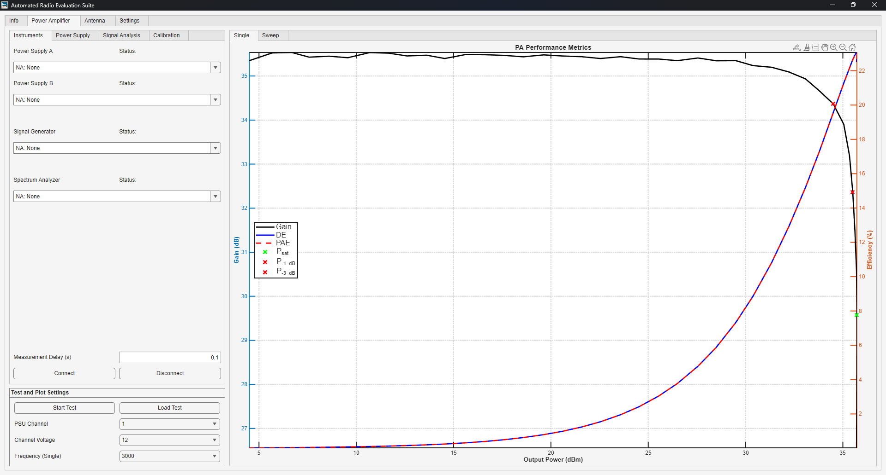
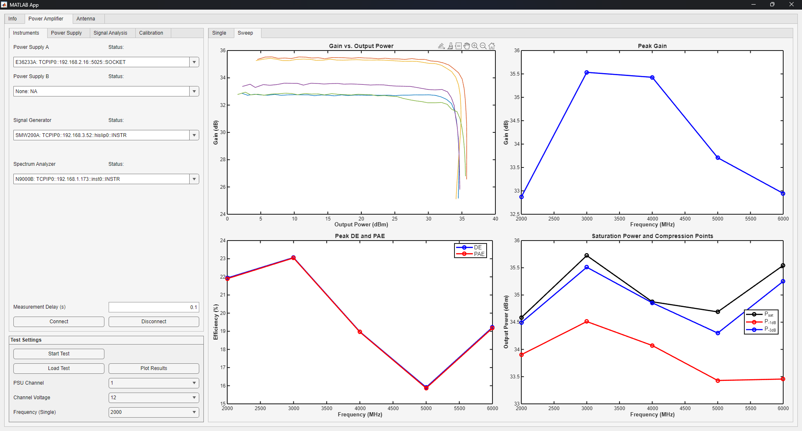

# PA Tutorial

The Power Amplifier (PA) module performs parametric measurements varying frequency, input RF power, and controlling up to four power supplies. The program will capture the measurements, calculate figures of merit (FoM), save the data, and plot the results.

## Theory

Figures of Merit: Gain, -1 dB compression point (P-1dB), -3 dB compression point (P-3dB), output saturation power (Psat), drain efficiency (DE), power added efficiency (PAE).

Calibration: (Direct Measure) Fixed, Small-Signal (passive) S-param, Large-signal driver measurement.

Calibration: (Indirect Measure) Not available. (TODO: Connect to two signal analyzers, one for the input and one for the output, measuring with -X dB couplers for 'coupled measurement').

## Performing the Measurement

### Connect to the instruments

The first step is to select the relevant instruments in each dropdown of the *Instruments* tab. Power supply selection is optinal but will limit the FoM that can be calculated. Select *None: NA* for the instruments that will not be used. Read the instrument connection tutorial for detailed information on how to edit the instrument database (comming soon...).

{witdh=1920px align=center}

Once all the addresses have been populated, click on *Connect* in the bottom to establish the connection to each instrument and *Disconnect* to clear all the connections. The *Measurement Delay* can be modified at any time before the measurement starts. This value is the time to wait between setting all the instruments and before capturing the data.

{witdh=1920px align=center}

### Configure the DC Power Supplies

Configure the DC Power Supplies (PSU) in the *Power Supply* tab. Select the appropiate *Supply Mode* depending on the number of PSUs needed and connected to in the *Instruments* tab. The app allows to connect up to two dual-output PSU. These supply mode options are the following:

* *No Supply:* Will not control or take measurement to any supply even if connected. 
* *Single Supply:* Will use a single output of one PSU. 
* *Dual Supply:* will use two outputs of one or two PSUs.
* *Quad Supply:* Will use all outputs of both dual-output PSUs.

{witdh=1920px align=center}

Each output will have a supply name (A or B) followed by the output number (1 or 2). Assign the corresponding settings for each output in the *Supply Channel* dropdown. Select if the supply is connected to the drain or gate (for efficiency calculations) and set if the supply will be static or swept. Set the *Current Limit* and *Start Volage* for static outputs. For multiple voltage levels, fill out the *Step Voltage* and *Stop Voltage* in addition to the static output inputs.

{witdh=1920px align=center}

### Configure the signal generator and analyzer

Configure the RF input signal in the *Signal Analysis* tab. Select in the *Measurement Type* dropdown if the measurement will be a *Single* or *Swept Frequencies*. In the *Signal Generator Settings Section*, fill out the *Start Frequency*, *Step Frequency*, and *Step Frequency* according to the measurement type. Set the *Start Power*, *Step Power*, and *Stop Power*. These settings are limited to the capabilites of the instruments (i.e., frequency and power range).

In the *Spectrum Analyzer Settings*, select an appropiate *Span*, number of *Sweep Points* and *Reference Level*. Default values should be feasable for most constant-wave (CW) measurements. The app will automatically change the center frequency of the signal analyzer to the same frequency as the signal generator.

{witdh=1920px align=center}

### Configure the measurement calibration

In the *Calibration* tab, it is optional to specify the input and output attenuations and load driver reference measurements. In the *Calibration Mode* dropdown, select one of the follwing modes:

* *None:* No 
* *Fixed:* Specify static input and output attenuation in decibels which will be applied equally to all frequencies. Used for passives (i.e., cables, attenuators, etc.).
* *Small Signal:* Load an s-parameter measurement  (*.s2p file) for the input and output to specify a frequency-dependent attenuation. This is used for passives (i.e., cables, attenuators, etc.). The fixed attenuation options are still available and it will added to the s-parameter attenuations.
* *Large Signal:* In addition to the small-signal calibration options, load a driver amplifier measurement following the same data format in the app. The DUT input power will be calculated by adding the input attenuation and grabing the output power of the driver at this input power and frequency. Intermediary values are linearly interpolated.

{witdh=1920px align=center}

### Run the test and plot the results

After validating all the settings, click on *Start Test* to begin the measurement. The progress window will display the time taken and estimated to complete. Once the test is completed, a prompt will open up to save the data. Once you enter the name and save the data, ARES will automatically load the data and plot it. A previous measurement can be plotted by loading the data in the *Load Test* button.

For each *PSU Channel* dropdown, select the corresponding *Channe; Voltage* to plot. The *Single* results view window will display the gain, efficiency, and compression points for the selected PSU voltages and value of the *Frequency* dropdown.

{witdh=1920px align=center}

The *Sweep* results view window will display all the gain curves, peak gain, efficiency, and compression points for each measured frequency. Right click on a plot for options to save it in the preffered format.

{witdh=1920px align=center}

