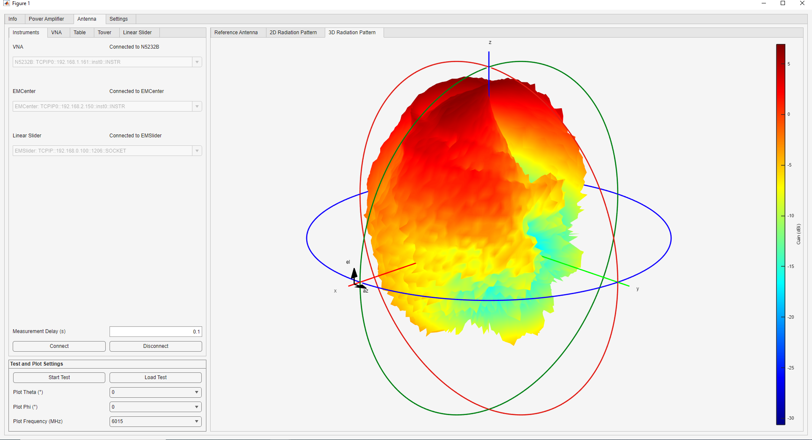

# Antenna Tutorial

The Antenna module performs parametric measurements varying the position of the DUT and gather the frequency response. The program will capture the measurements, calculate the gain, save the data, and plot the results. Note the test does not need to be run every time as the data can be loaded into the app. Sample data is available in [data/Antenna](https://github.com/AlexDCode/AutomatedRadioEvaluationSuite/tree/main/data/Antenna).

## Theory

Friis Path Loss, Gain Comparison method, Gain transfer method. 

## Performing the Measurement

### Calibration
To get started, calibrate the Vector Network Analyzer (VNA) at the measurement plane, where the reference antenna and DUT will be connected. Ensure the frequency range and number of points (or step size) are as desired before caliration. Using an eCal is highly recommended as shown in the [demonstration](https://youtu.be/OefvtshJiC0?si=ZZNQlMm1ttoYM5Pf).

### Connect to the instruments

The first step is to select the relevant instruments in each dropdown of the *Instruments* tab. Select *None: NA* for the instruments that will not be used. Read the instrument connection tutorial for detailed information on how to edit the [instrument database](https://aresapp.readthedocs.io/latest/tutorial_instr.html). Once all the addresses have been populated, click on *Connect* in the bottom to establish the connection to each instrument and *Disconnect* to clear all the connections. The *Measurement Delay* can be modified at any time before the measurement starts. This value is the time to wait between setting all the instruments and before capturing the data.

### Load Reference Antenna Data (for Gain Comparison Method)

Reference Antenna View

{witdh=1920px align=center}

### Configure the VNA

### Configure the table (theta axis)

### Configure the tower (phi axis)

### Configure the linear slider

### Run the test and plot the results

After validating all the settings, click on *Start Test* to begin the measurement. The progress window will display the time taken and estimated to complete. Once the test is completed, a prompt will open up to save the data. Once you enter the name and save the data, ARES will automatically load the data and plot it. A previous measurement can be plotted by loading the data in the *Load Test* button. The typical time to run a test in the ARES lab is:

* Scan $\theta$ ($1^{\circ}$ step) with fixed $\phi$: ~16 minutes
* Scan $\theta$ ($3^{\circ}$ step) with fixed $\phi$: ~8 minutes
* Scan $\theta$ ($5^{\circ}$ step) with fixed $\phi$: ~6 minutes
* 3D scan ($3^{\circ}$ step for both $\theta$ and $\phi$): ~20 hours

The *2D Radiation Pattern* results view window will display the realized gain vs. frequency, return loss, and 2D radiation pattern for the selected value of the *Frequency*, *$\theta$* cut, and *$\phi$* cut dropdowns.

{witdh=1920px align=center}

The *3D Radiation Pattern* results view window will display the realized gain vs. frequency, return loss, and 2D radiation pattern for the selected value of the *Frequency* dropdown.

{witdh=1920px align=center}

