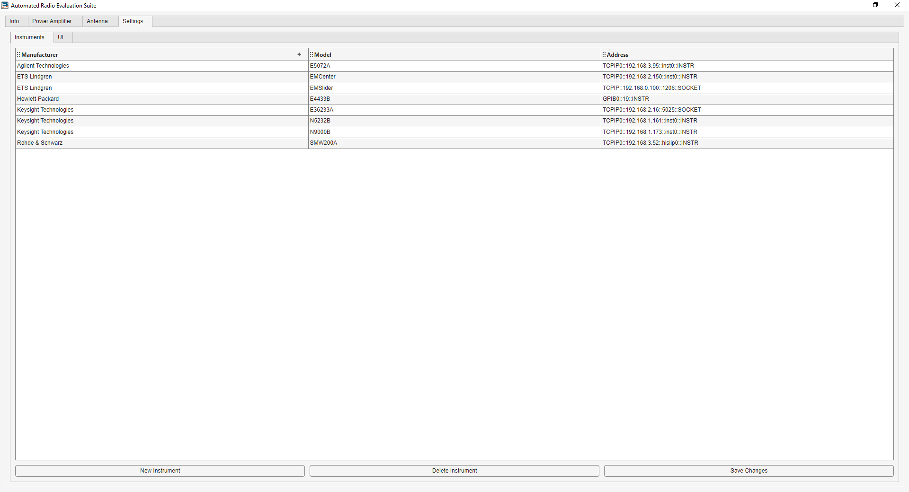

# Instrument Database Tutorial

The instrument database is saved as a .csv file to the MATLAB user path, within the ARES directory. The app will create a copy from the source code as an example when this file does not exist. To add instruments, click on *New Instrument* and fill out the required information. The *Model* and *Address* will be displayed on the *Intruments* tabs for each module. To remove instruments, select the corresponding row and click on *Delete Instrument*. When all changes are compelte, click on *Save Changes* and the user database will be updated. Explore the [Instrument Interfacing](https://aresapp.readthedocs.io/latest/instr_interface.html) code reference to learn how ARES interacts with the instruments.

{witdh=1920px align=center}
